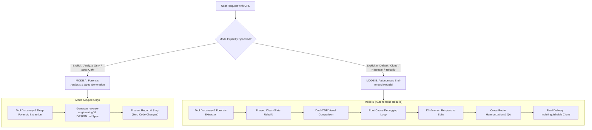

# Autonomous Website Reverse-Engineering & Reconstruction Skill

A complete, battle-tested forensic engineering system for reverse-engineering reference websites and reconstructing their visual architecture, container geometry, stateful interactions, responsive layouts, and motion choreography with sub-pixel and microsecond precision.

This skill is **Tool-First, Evidence-First, and Autonomous**. When given a reference URL and asked to clone, rebuild, or recreate the site, the agent orchestrates the best available specialized visual-forensics tools, cross-validates evidence against the browser runtime, and executes the complete multi-phase workflow end-to-end without requiring repetitive user steering prompts.

---

## Quick Navigation

- [Operational Modes: Mode A vs Mode B](#operational-modes-mode-a-vs-mode-b)
- [The Tool-First & Evidence-First Principle](#the-tool-first--evidence-first-principle)
- [Tool Discovery Protocol & Capability Matrix](#tool-discovery-protocol--capability-matrix)
- [Cross-Validation & Evidence Standards](#cross-validation--evidence-standards)
- [Specialized Tool Protocols](#specialized-tool-protocols)
  - [Capture Motion Protocol](#a-capture-motion-protocol)
  - [CSS Peeper Protocol](#b-css-peeper-protocol)
  - [Woblo Protocol](#c-woblo-protocol)
  - [DESIGN.md Protocol](#d-designmd-protocol)
  - [SKILL Extractor Protocol](#e-skill-extractor-protocol)
- [The Master Forensic Workflow](#the-master-forensic-workflow)
- [The Automated Engine & CLI Architecture](#the-automated-engine--cli-architecture)
- [Dynamic Route Clustering & Representative Instances](#dynamic-route-clustering--representative-instances)
- [The Tool Evidence Log Standard](#the-tool-evidence-log-standard)
- [Common Architectural Traps & Failure Prevention](#common-architectural-traps--failure-prevention)
- [The 17 Quality Gates](#the-17-quality-gates)
- [Self-Audit Checklist](#self-audit-checklist)
- [Companion Skills Integration](#companion-skills-integration)
- [Ethical, Security & Legal Guardrails](#ethical-security--legal-guardrails)

---

## Operational Modes: Mode A vs Mode B



### Mode Determination Rule
- **MODE B (DEFAULT)**: Whenever the user states "rebuild", "clone", "recreate", "make a replica", "reproduce", or simply supplies a URL without explicitly restricting the task to analysis, **default to Mode B**.
- **MODE A**: Triggered ONLY when the user explicitly requests an analysis, audit, design token extraction, or specification document without modifying or creating application code.

---

## The Tool-First & Evidence-First Principle

**NEVER guess or assume computed values from screenshots or visual memory.**
**DO NOT immediately recreate tool functionality using custom scratch scripts when specialized visual-forensics tools, extensions, or skills are available.**

The preferred workflow is always:
$$\text{Specialized Tool} \longrightarrow \text{Verify with Browser/Source} \longrightarrow \text{Reconstruct}$$
rather than:
$$\text{Custom Approximation} \longrightarrow \text{Assume Correctness (Strict Violation!)}$$

### Epistemic Confidence Levels

| Level | Classification | Definition | Verification Standard |
| :--- | :--- | :--- | :--- |
| **Level A** | **Directly Observed Fact** | Markup, DOM hierarchy, attributes, class names, asset URLs. | Present in raw HTML or serialized DOM. |
| **Level B** | **Extracted Value** | Computed styles and metrics directly read from the rendering engine. | `window.getComputedStyle()`, `getBoundingClientRect()`. |
| **Level C** | **Experimentally Verified** | State transformations verified by triggering events in the browser. | Event triggered + style/DOM mutation recorded. |
| **Level D** | **Reasonable Inference** | Logically deduced from patterns when direct extraction is obscured. | MUST be explicitly tagged as `[Inferred]`. |
| **Level E** | **Unknown / Obscured** | Private backend logic, obscured canvas shaders, or blocked APIs. | MUST be flagged as `[Unknown]` with fallback proposal. |

---

## Tool Discovery Protocol & Capability Matrix

### Step 0: Tool & Environment Discovery Must Happen First
Before beginning any website reconstruction, actively inspect the environment to detect which specialized tools, extensions, and capabilities are provided:

```
CHECK ENVIRONMENT:
1. Browser Extensions: Capture Motion, CSS Peeper, Woblo, Webmimic, Slicer
2. MCP Tooling: chrome-devtools-mcp (CDP navigation, screenshots, evaluate_script)
3. Specialized Skills: workflow-skill-creator / SKILL Extractor, design-taste-frontend
4. Automation Engines: Playwright, Puppeteer, Node CDP
```

### The Visual Forensics Capability Matrix

| Tool | Core Capability | When to Use | Direct Output | Fallback Hierarchy |
| :--- | :--- | :--- | :--- | :--- |
| **Capture Motion** | Micro-motion & animation recording, frame stepping, easing curves | Complex hover, hover-exit, scroll parallax, magnetic cursor physics, page transitions | Exact animation curves, durations, delays, stagger orders | 1. Chrome DevTools MCP (`getAnimations()`, GSAP inspection)<br>2. WAAPI runtime extraction<br>3. Source JS/timeline reverse-engineering |
| **CSS Peeper** | Rapid design-token extraction, color palettes, typography specs, spacing | Initial design system scan, component dimension extraction, asset downloading | Clean token list (hex/rgba, font-family, sizes, line-heights, padding) | 1. Chrome DevTools computed styles (`getComputedStyle`)<br>2. `scripts/extract-design-tokens.js`<br>3. Raw CSS stylesheet AST parsing |
| **Woblo** | Visual/UI structural analysis, layout relationship decomposition | Deep visual hierarchy mapping, nested layout analysis, component boundary detection | Visual layout maps, component relationship trees, spatial groupings | 1. Browser DOM visual inspection via CDP screenshots<br>2. `scripts/audit-route-geometry.js`<br>3. Rendered bounding-box analysis |
| **DESIGN.md Tooling** | Structured design-system documentation generation | Translating extracted evidence into standardized design-system markdown | Publication-grade `DESIGN.md` capturing tokens, components, and rules | 1. Re-engineering design templates (`templates/DESIGN_SYSTEM.md`)<br>2. Manual structured extraction from verified tokens |
| **SKILL Extractor** (e.g. `workflow-skill-creator`) | Codifying validated reconstruction workflows into reusable agent skills | When a novel, proven forensic workflow or failure-prevention rule is validated on a real site | Validated `SKILL.md` update in global skills configuration | 1. Direct manual editing of `SKILL.md` and `references/`<br>2. Global skill architecture update |
| **Chrome DevTools / CDP** | Runtime execution, DOM manipulation, console logs, network payloads | Programmatic inspection, synthetic event triggering, layout bounding boxes | Raw computed styles, event listener trees, live DOM mutations | 1. Headless Puppeteer / Playwright CLI scripts<br>2. Static fetch + Cheerio parser |

---

## Cross-Validation & Evidence Standards

Important findings must be **cross-validated across dual observation channels** to eliminate tool-specific false positives or missed media queries:

```
CSS Peeper (Extracted Tokens)        + Chrome DevTools (window.getComputedStyle)
Capture Motion (Recorded Curves)     + Source JavaScript (GSAP timeline parameters)
Woblo (Visual Layout Map)            + Rendered Geometry (getBoundingClientRect Δ <= 1px)
Asset Inspector (Exported SVG)       + Raw DOM Markup (viewBox & path verification)
```

---

## Specialized Tool Protocols

### A. Capture Motion Protocol
When Capture Motion is available, execute forensic motion capture across all interactive states:
- **Hover & Re-entry**: Record entry coordinate, scale, translation, duration, and easing. Record exit trajectory (does fill follow cursor or collapse?). Test rapid re-entry for smooth blending vs jarring snaps.
- **Scroll-Driven Parallax**: Record vertical displacement relative to window scroll delta ($\Delta y$). Identify linear scrub vs lerp inertia.
- **Magnetic Fields**: Record attraction radius, spring damping, and stiffness coefficients.
- **Curved Masks**: Record path morphing or border-radius transitions during scroll.
- **Spatial Motion Rule**: Never reduce complex motion to opacity/scale fading if Capture Motion reveals spatial translation, staggered character transforms, or DrawSVG path trimming.

### B. CSS Peeper Protocol
When CSS Peeper is available:
- Extract global color tokens (brand, surface, typography, borders, status).
- Extract typography hierarchy (font-family, sizes, weights, line-heights, letter-spacing).
- Extract spacing metrics (section paddings, container max-widths, column gaps).
- Export vector assets and icons with native SVG dimensions.
- **Cross-Check**: Confirm tokens against `window.getComputedStyle(element)`.

### C. Woblo Protocol
When Woblo is available:
- Inspect high-level visual geometry and layout rhythm.
- Isolate compound component boundaries (e.g. card groups, sticky sidebars, hero split layouts).
- Document visual patterns and responsive layout shifts.
- **Cross-Check**: Verify against actual rendered browser geometry (`getBoundingClientRect()`).

### D. DESIGN.md Protocol
When DESIGN.md tooling or workflow is invoked:
- Build a living design system document grounded strictly in Level B extracted values.
- Capture design principles, color tokens, fluid typography scales, layout rules, interaction states, and motion tokens.
- **Anti-Hallucination Guardrail**: Keep `DESIGN.md` strictly synchronized with observed reality. Do NOT invent hypothetical tokens not present on the reference site.

### E. SKILL Extractor Protocol
When reusable workflow distillation is triggered:
- **Scope Restriction**: Only extract **reusable, generalized methodologies, forensic workflows, failure-prevention rules, and QA gates**.
- **Strict Exclusion**: NEVER extract website-specific implementation details (e.g. specific client names, hex colors, font names, specific layout dimensions, or proprietary copy) into global skills unless explicitly instructed.

---

## The Master Forensic Workflow

```
DISCOVER WEBSITE (sitemap, robots, HTML crawl, JS bundle scan)
       ↓
DISCOVER AVAILABLE FORENSIC TOOLS (Step 0)
       ↓
MAP TOOL → CAPABILITY MATRIX
       ↓
BUILD ROUTE GRAPH & CLUSTER DYNAMIC FAMILIES (/work/:slug)
       ↓
COLLECT PAGE-BY-PAGE EVIDENCE & MEDIA ASSETS (evidence/<route>/)
       ↓
GENERATE GLOBAL DESIGN SYSTEM & ROUTE-SPECIFIC PAGE SPECS
       ↓
RECONSTRUCT INCREMENTALLY (Native stack, subpages self-contained in <head>)
       ↓
AUDIT ROUTE COVERAGE & NAVIGATION INTEGRITY (Zero FOUC, zero 404s)
       ↓
VERIFY SPATIAL GEOMETRY (Container-first, Δ <= 1px)
       ↓
EVALUATE 17 QUALITY GATES VIA RUN-QUALITY-GATES.JS (Block First-Page Mirage)
       ↓
FINAL EVIDENCE-BASED QA SIGN-OFF (FINAL_QA.md)
```

---

## The Automated Engine & CLI Architecture

To prevent subjective approximation and eliminate the First-Page Mirage, the skill is backed by an executable Node.js forensic engine located in `scripts/`:

```
scripts/
├── reverse-engineer-cli.js       # Master unified CLI orchestrator
├── discover-routes.js            # Multi-source route discovery (sitemap, robots, DOM, scripts)
├── build-route-graph.js          # Hierarchical route graph builder & dynamic route clustering
├── collect-page-evidence.js      # Structured page-by-page evidence collector
├── extract-assets.js             # Multi-page media and asset harvester
├── generate-page-specs.js        # Global design system & route-specific page spec generator
├── audit-route-coverage.js       # Route completeness, FOUC, and navigation integrity auditor
├── verify-geometry-and-visuals.js# Container-first sub-pixel geometry delta verifier
├── run-quality-gates.js          # Hard Quality Gate evaluator & FINAL_QA.md enforcer
├── audit-route-geometry.js       # In-browser DOM geometry extractor (console/CDP)
├── extract-design-tokens.js      # In-browser computed tokens extractor
├── inspect-animations.js         # In-browser animation & ScrollTrigger inspector
├── interaction-crawler.js        # In-browser interactive reachability crawler
└── capture-comparison.js         # Multi-viewport capture & visual metrics helper
```

### CLI Quick Reference

```bash
# 1. Multi-source route discovery
node scripts/reverse-engineer-cli.js discover https://example.com --out discovered.json

# 2. Build route graph and cluster dynamic templates
node scripts/reverse-engineer-cli.js graph discovered.json --out route-graph.json --md ROUTE_INVENTORY.md

# 3. Collect page-by-page evidence
node scripts/reverse-engineer-cli.js evidence route-graph.json --out ./evidence

# 4. Harvest all media assets
node scripts/reverse-engineer-cli.js assets ./evidence --download ./public --out ASSET_INVENTORY.md

# 5. Generate page specifications
node scripts/reverse-engineer-cli.js specs route-graph.json --evidence ./evidence --outDir ./specs

# 6. Audit local workspace route coverage and navigation integrity
node scripts/reverse-engineer-cli.js coverage route-graph.json --workspace ./ --out ROUTE_COVERAGE_MATRIX.md

# 7. Evaluate the 17 Quality Gates & enforce First-Page Mirage block
node scripts/reverse-engineer-cli.js qa route-graph.json --workspace ./ --out FINAL_QA.md

# Or execute full automated pipeline:
node scripts/reverse-engineer-cli.js pipeline https://example.com --workspace ./
```

---

## Dynamic Route Clustering & Representative Instances

A major architectural trap is treating dynamic routes as flat, isolated pages or assuming one sample represents the entire family.

When the route engine discovers parameterized paths (e.g. `/projecten/alquion`, `/projecten/limelight`, `/projecten/ausems`):
1. **Cluster into Template**: Groups them into `/projecten/:slug`.
2. **Representative Sampling**: Preserves up to 5 representative instances for independent testing and verification.
3. **Template vs Instance Specification**: Documents the shared structural wrapper (layout, hero banner, related links) versus instance-variable slots (project title, gallery assets, client metadata).
4. **Verification Obligation**: Quality Gate QG-01 strictly requires that dynamic route families are tested across multiple representative instances.

---


## The Tool Evidence Log Standard

In every forensic analysis report and implementation walkthrough, the agent must include a structured **Tool Evidence Log** documenting which tools were leveraged, what evidence was gathered, and how it impacted code reconstruction.

### Required Status Classifications
Every tool evaluated must be explicitly categorized under one of four statuses:
1. `ACTUALLY USED`: The tool was executed and generated verified forensic evidence.
2. `AVAILABLE BUT NOT NEEDED`: The tool is present in the environment, but the site's architecture did not require it (e.g. Capture Motion on a static text page).
3. `UNAVAILABLE`: The tool is not present in the current environment.
4. `FALLBACK USED`: The tool was unavailable, so the designated fallback engine was invoked.

> [!CAUTION]
> **Anti-Falsification Rule**:
> NEVER write *"Capture Motion verified this"* unless Capture Motion was genuinely invoked.
> NEVER write *"CSS Peeper extracted this"* unless CSS Peeper actually produced the token file.

### Example Tool Evidence Log

```markdown
### Forensic Tool Evidence Log

| Tool | Status | Forensic Task | Key Observation / Extracted Evidence | Implementation Impact | Cross-Validation Source |
| :--- | :--- | :--- | :--- | :--- | :--- |
| **Capture Motion** | ACTUALLY USED | Hero title & portrait entrance | Chars stagger 0.05s with Expo.easeOut over 1.5s; image scales 1.5 -> 1.0 | Built GSAP loader timeline with exact stagger & ease | Confirmed via `window.gsap` timeline inspection |
| **CSS Peeper** | ACTUALLY USED | Design token extraction | Background `#e3e3df`, primary green `#33423a`, lightgreen `#abb7aa` | Formatted into CSS variables in `:root` | Verified via `getComputedStyle(body)` |
| **Woblo** | AVAILABLE BUT NOT NEEDED | Page section layout | Single-page narrative structure with 10 vertical sections | Section order mirrored in semantic HTML | Verified via DOM tree traversal |
| **SKILL Extractor** | ACTUALLY USED | Methodology codification | 14-phase workflow and tool orchestration validated | Codified into global `website-reverse-engineering` skill | Verified via skill self-audit checklist |
| **Playwright** | UNAVAILABLE (FALLBACK USED) | Headless dual capture | Fallback: `chrome-devtools-mcp` evaluate_script & take_screenshot | Captured dual screenshots at identical viewports | Local & remote image diff |
```

---

## Common Architectural Traps & Failure Prevention

| # | Common Anti-Pattern / Failure Mode | Root Cause | Mandatory Architectural Prevention Rule |
|---|-------------------------------------|------------|-----------------------------------------|
| 1 | **Overlay Pointer-Events Trap**<br>(Buttons unclickable in footer or hero) | Transparent gradient overlays or decorative masks sitting above interactive elements. | All decorative overlays, gradients, and canvas wrappers MUST declare `pointer-events: none !important;`. |
| 2 | **Camouflaged Curve Mask Trap**<br>(Curved transition looks broken or invisible) | Background color of curve container is hardcoded to a fixed theme color instead of matching the preceding section. | Mask curves (`.rounded-div-wrap`) must dynamically inherit or mirror the exact background color of the preceding section. |
| 3 | **Inactive Parallax Engine Trap**<br>(`[data-scroll]` attributes present in DOM but static) | Parallax markup copied without initializing the Lenis/Locomotive proxy or GSAP ScrollTrigger ticker. | Always connect the smooth-scroll engine to GSAP ticker and bind `[data-scroll]` speed attributes to vertical translation triggers. |
| 4 | **Touchscreen Laptop Mouse Trap**<br>(Magnetic cursor dead on Windows touch laptops) | Code disables hover/magnetism if `navigator.maxTouchPoints > 0`. | Never disable mouse physics via touch detection. Use `window.matchMedia("(hover: hover) and (pointer: fine)").matches`. |
| 5 | **Artificial Line Break (`<br>`) Trap**<br>(Text wraps awkwardly on other screen sizes) | Inserting hardcoded `<br>` tags to force text wrapping to match desktop reference. | Text wrapping must be controlled purely by container `max-width`, column constraints, or inline-block spans. |
| 6 | **SPA Scroll Reset Trap**<br>(Navigating to home starts halfway down page) | Client-side router preserves window scroll position on navigation. | In the router lifecycle hook (e.g. `router.afterEach`), immediately call `window.scrollTo(0, 0)` and refresh ScrollTrigger. |
| 7 | **Leaked Animation / RAF Trap**<br>(Lags after navigating across multiple pages) | Timelines, event listeners, or requestAnimationFrame loops not cleaned up on component unmount. | Every mounted component must return an explicit cleanup function that invokes `timeline.kill()` and removes listeners. |
| 8 | **First-Page Mirage Trap**<br>(Home page passes, but remaining pages are broken or unstyled) | Declaring the website complete after only the homepage succeeds; treating the first page as the entire project rather than a quality baseline. | A multi-page website is NEVER complete until 100% of discovered public routes independently pass forensic extraction, container geometry, and the 17 Quality Gates. The first page is an internal quality benchmark, NOT project completion. |
| 9 | **Target Drift & Cross-Project Pollution Trap**<br>(Subpages serve stale content from prior projects) | Rebuilding a new site inside an existing workspace without purging residual routes or locking project identity, leading to mixed-site states. | Lock the active target domain, brand, and URL at Step 0. Explicitly verify that every route directory (`/about`, `/work`, etc.) belongs to the active target domain and contains zero residual files from prior tasks. |
| 10 | **Headless Head / FOUC Trap on Direct Route Entry**<br>(Direct link entry renders raw unstyled HTML) | Relying solely on client-side JS bundle injection for stylesheets, causing direct visits or bookmark loads to fail without CSS. | Every route's HTML entrypoint (`/about/index.html`, etc.) must be completely self-contained, linking production stylesheets and font preloads directly in `<head>`. |

---

## The 17 Quality Gates

Before declaring any reconstruction task complete, all 17 Quality Gates must be satisfied:

```markdown
- [ ] QG-01: 100% of discovered public routes are implemented and navigable.
- [ ] QG-02: Maximum structural container width deviation Δ <= 1px.
- [ ] QG-03: Vertical section rhythm and heights match reference proportions.
- [ ] QG-04: Zero artificial <br> tags used for line wrapping.
- [ ] QG-05: Typography font-family, weights, line-heights, and tracking match computed values.
- [ ] QG-06: Color and gradient tokens extracted and applied without guesswork.
- [ ] QG-07: Vector SVGs rendered 1:1 with crisp viewBox and currentColor bindings.
- [ ] QG-08: All buttons and interactive controls are verified clickable (zero overlay blockages).
- [ ] QG-09: Magnetic buttons follow mouse smoothly and return with natural damping.
- [ ] QG-10: Circular fill hover animations expand from cursor entry point.
- [ ] QG-11: Parallax scroll speeds and transforms are active and synchronized with scroll.
- [ ] QG-12: Organic curved masks seamlessly transition into footers without background mismatch.
- [ ] QG-13: Re-navigating to home or any route strictly resets scroll to (0, 0).
- [ ] QG-14: SPA lifecycle cleanly disposes of timers, RAF loops, and listeners on unmount.
- [ ] QG-15: Fluid adaptability verified across all 12 target viewports (320px to 3840px).
- [ ] QG-16: Cross-page design token and component consistency harmonized.
- [ ] QG-17: Side-by-side visual comparison passes human-eye inspection with indistinguishable fidelity.
```

---

## Self-Audit Checklist

Every execution of this skill must be able to answer these 9 essential questions:
1. **What tools are available in the current environment?** Checked in Step 0 (CDP, extensions, skills).
2. **Which tool should inspect motion?** Capture Motion first; fallback to GSAP/WAAPI browser inspection.
3. **Which tool should inspect CSS/design tokens?** CSS Peeper first; fallback to `getComputedStyle()`.
4. **Which tool should inspect visual design?** Woblo first; fallback to rendered geometry & CDP screenshots.
5. **Which tool should generate design documentation?** DESIGN.md workflow; fallback to `templates/DESIGN_SYSTEM.md`.
6. **Which tool can extract reusable skill knowledge?** SKILL Extractor (`workflow-skill-creator`); fallback to manual skill update.
7. **What is the fallback if each tool is unavailable?** Follow the strict Fallback Hierarchy in the Capability Matrix.
8. **How do we prove the tool was actually used?** Documented via the structured Tool Evidence Log with real extracted evidence.
9. **How do we cross-check its findings?** Verified across dual observation channels (Tool + Browser Ground Truth).

---

## Companion Skills Integration

Coordinate with complementary specialized skills during execution:
- **`design-taste-frontend`**: Refine bespoke aesthetic rhythm, subtle borders, and intentional typography contrast.
- **`high-end-visual-design`**: Polish editorial layouts, luxury portfolio nuances, and fluid micro-interactions.
- **`uxui-principles`**: Validate usability, accessible focus rings, and cognitive ergonomics.
- **`performance-optimizer`**: Guarantee 60fps animations, eliminate layout thrashing, and optimize GPU composite layers.
- **`codebase-audit-pre-push`**: Purge debugging logs, dead CSS selectors, and temporary scratch files before delivery.

---

## Ethical, Security & Legal Guardrails

1. **Public Information Only**: Only reverse-engineer client-side code and public DOM assets delivered to the browser.
2. **No Secret Extraction**: Never copy, extract, or retain API keys, tokens, cookies, or backend credentials.
3. **No Security Control Bypass**: Do not bypass anti-bot protections, CAPTCHAs, paywalls, or authentication barriers.
4. **Data Privacy**: Never collect or reproduce real personal identifiable information (PII). Use clean synthetic mock data.
5. **Asset Replacement**: For proprietary corporate logos, copyrighted photography, or trademarked material, utilize clean SVG placeholders or licensed royalty-free alternatives in production code.
